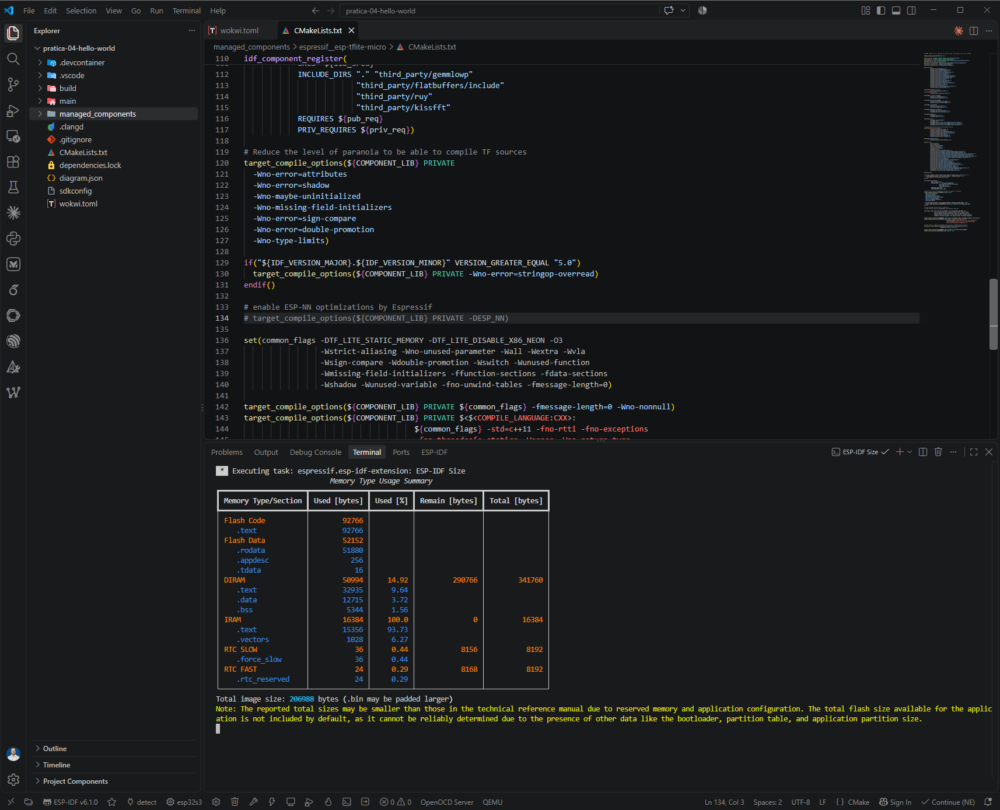
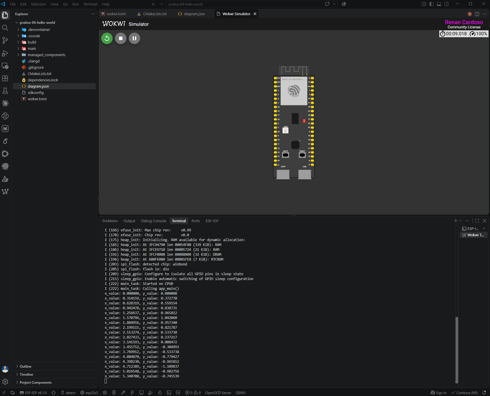
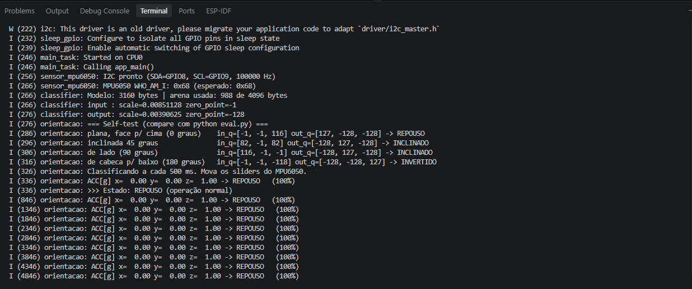
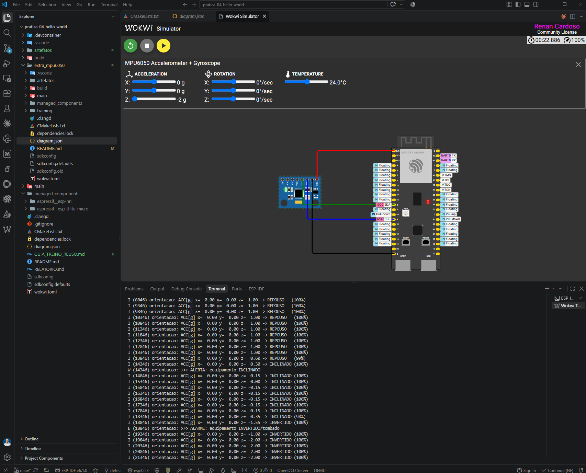

# Prática 4/6: Hello World com TensorFlow Lite Micro e extra com MPU6050

- **UC:** IA Embarcada e Modelos Compactos (Pós-graduação em Inteligência Artificial Aplicada, UniSENAI)
- **Prof.:** MSc. Rodrigo Kobashikawa Rosa
- **Aluno:** Renan Cardoso

📄 **Relatório de análise (item 3 e análise do extra):** [`RELATORIO.md`](RELATORIO.md)

---

## O desafio

**Atividade principal (Parte A)**

1. Reproduzir os passos do Hello World;
2. Print da tela do Wokwi rodando o Hello World;
3. Análise do código e documentação em um breve relatório sobre as observações encontradas.

**Atividade extra (Parte B, +1 ponto)**

- Modificar o código para uma nova aplicação, com novo sensor e novo dataset;
- Não pode ser outro exemplo do `esp-tflite-micro`, exceto com novo retreino/fine-tuning do modelo para novas funcionalidades.

### Requisitos e como foram atendidos

| # | Requisito | Como foi atendido | Status |
|---|---|---|---|
| 1 | Reproduzir os passos do Hello World | Projeto ESP-IDF criado do zero; `espressif/esp-tflite-micro` do Registry; exemplo `hello_world` em `main/`; ESP-NN desligado para o Wokwi | ✅ build + simulação |
| 2 | Print do Wokwi rodando o Hello World | Senoide no monitor serial ([Evidências da Parte A](#evidências-da-parte-a)) | ✅ screenshot |
| 3 | Relatório de análise | [`RELATORIO.md`](RELATORIO.md) | ✍️ em redação |
| Extra | Nova aplicação, novo sensor, novo dataset | Classificador de orientação com **MPU6050**, dataset sintético e treino próprio ([Parte B](#parte-b-extra-classificador-de-orientação-com-mpu6050)) | ✅ build, simulação e evidências |

### Stack

| Item | Escolha |
|---|---|
| Placa | ESP32-S3-DevKitC-1 (simulada no Wokwi) |
| Framework | ESP-IDF v6.1 (a aula foi gravada na v5.5.3) |
| Linguagem | C++ para o TFLite Micro (arquivos `.cc`); C para o driver do sensor |
| Biblioteca | `espressif/esp-tflite-micro` **1.4.1** (+ `espressif/esp-nn` 1.4.1); `espressif/mpu6050` **1.2.1** no extra |

---

## Parte A: Hello World

O Hello World do TFLite Micro é uma rede neural minúscula (MLP 1 → 16 → 16 → 1, 321 parâmetros, int8) que aproxima **`y = sin(x)`** em `[0, 2π]`. O seno é só pretexto: o exercício é o pipeline completo de IA embarcada, **treinar → converter para `.tflite` int8 → embutir como array C → inferir no microcontrolador**.

**Circuito:** só a placa. O [`diagram.json`](diagram.json) liga `esp:TX → $serialMonitor:RX` e `esp:RX → $serialMonitor:TX`; sem essas conexões, o terminal fica mudo.

**ESP-NN desligado para o Wokwi:** o ESP-NN usa instruções SIMD do ESP32-S3 que o Wokwi não simula. O [`main/CMakeLists.txt`](main/CMakeLists.txt) acrescenta `-UESP_NN` às flags do componente, sem editar `managed_components/`. **Numa placa física, remova essas duas linhas.** Detalhes na seção 7.1 do relatório.

### Como rodar

Ative o ambiente do ESP-IDF (PowerShell, instalação via EIM):

```bash
. 'C:\Espressif\tools\Microsoft.v6.1.PowerShell_profile.ps1'
```

Na raiz deste projeto, compile (o primeiro build baixa as dependências para `managed_components/`):

```bash
idf.py build
```

Depois abra o `diagram.json` e rode `Ctrl+Shift+P` → **`Wokwi: Start Simulation`**. Sem build não há simulação: o Wokwi executa o `.elf` apontado pelo [`wokwi.toml`](wokwi.toml).

### Saída esperada

Uma inferência a cada 500 ms; `x` percorre `[0, 2π)` em 20 passos:

```
x_value: 0.000000, y_value: 0.000000
x_value: 0.314159, y_value: 0.372770
x_value: 1.570796, y_value: 1.042060
x_value: 3.141593, y_value: 0.008472
x_value: 4.712389, y_value: -1.109837
...
```

### Evidências da Parte A

**Build concluído** (ESP-IDF v6.1.0, target `esp32s3`, imagem de 206.988 bytes, DIRAM 14,92%):



> Este print é de uma versão anterior, em que o ESP-NN era desligado comentando a linha 134 de `managed_components/espressif__esp-tflite-micro/CMakeLists.txt`. A versão atual usa `-UESP_NN` no `main/CMakeLists.txt`, que sobrevive a clone e Full Clean.

**Wokwi rodando o Hello World** (licença `Renan Cardoso — Community License`, ciclo completo da senoide):



---

## Parte B (extra): classificador de orientação com MPU6050

Projeto ESP-IDF próprio em [`extra_mpu6050/`](extra_mpu6050/README.md): **novo sensor** (MPU6050 via I2C), **novo dataset** (1.800 leituras sintéticas do acelerômetro) e **novo treino** (classificador de 3 classes treinado do zero, com `train.py`/`eval.py` adaptados dos scripts do exemplo oficial).

**Aplicação:** monitor de postura de equipamentos que só operam com segurança numa posição (cilindro de gás, gabinete sobre rodízios, carrinho/AGV). O MPU6050 fica preso ao equipamento e o modelo classifica a leitura:

| Classe | Inclinação θ | Ação |
|---|---|---|
| `REPOUSO` | 0° a 30° | Operação normal |
| `INCLINADO` | 30° a 120° | **Alerta**: inspeção |
| `INVERTIDO` | 120° a 180° | **Alarme**: equipamento tombou |

**Circuito:** MPU6050 com VCC → 3V3, GND → GND, SDA → GPIO8, SCL → GPIO9 (endereço `0x68`).

### Resultados

| Item | Valor |
|---|---|
| Modelo | MLP 3 → 8 → 8 → 3 (131 parâmetros), int8, 3.160 bytes |
| Acurácia no teste (float32 / int8) | 0,9926 / 0,9926 (concordância de 100%) |
| Tensor arena usada no ESP32-S3 | 988 de 4.096 bytes |
| Self-test no boot × `eval.py` | Os 4 vetores de referência **idênticos byte a byte** |
| Classes no Wokwi | As 3, com `>>> ALERTA` e `>>> ALARME` só na transição de estado |

A análise completa (memória, achado de leitura fora da distribuição de treino, limitações) está na **seção 8 do [relatório](RELATORIO.md)**. Para build, simulação e retreino, veja o [README do extra](extra_mpu6050/README.md) e o [guia de reprodução e reuso](extra_mpu6050/GUIA_TREINO_REUSO.md).

### Evidências da Parte B

**Boot:** `WHO_AM_I: 0x68`, arena usada, self-test igual ao `eval.py` e `REPOUSO` com os sliders em (0, 0, 1):



**Classes e eventos:** varredura do eixo Z de +1 g a −2 g, com as transições REPOUSO → INCLINADO (`W >>> ALERTA`) → INVERTIDO (`E >>> ALARME`):



---

## Estrutura do repositório

```
pratica-04-hello-world/
├── README.md                 # este arquivo: visão geral da entrega
├── RELATORIO.md              # análise do código e observações (Partes A e B)
├── CMakeLists.txt            # project(pratica-04-hello-world)
├── sdkconfig.defaults        # target esp32s3 (o sdkconfig não vai para o git)
├── dependencies.lock         # versões exatas dos componentes
├── diagram.json / wokwi.toml # circuito e firmware do Wokwi
├── main/                     # Parte A: hello_world do TFLM
│   ├── main.cc               # app_main → setup() + loop() a cada 500 ms
│   ├── main_functions.cc/.h  # modelo, op resolver, interpretador, inferência
│   ├── model.cc/.h           # modelo .tflite como array C (g_model)
│   ├── constants.cc/.h       # kXrange = 2π, kInferencesPerCycle = 20
│   ├── output_handler.cc/.h  # imprime x_value / y_value
│   └── CMakeLists.txt        # SRCS + -UESP_NN
├── extra_mpu6050/            # Parte B: projeto ESP-IDF próprio
│   ├── README.md             # como usar o extra
│   ├── GUIA_TREINO_REUSO.md  # reproduzir o treino e reusar os scripts
│   ├── main/                 # sensor (C) + classificador TFLM (C++)
│   └── training/             # train.py, eval.py, dataset, modelos, métricas
└── artefatos/                # screenshots da entrega
    ├── 01_screenshot_build_successful.png
    ├── 02_screenshot_wokwi_hello_world.png
    ├── 03_screenshot_extra_wokwi_sensor_mpu6050.png
    └── 04_screenshot_extra_wokwi_boot_self_test.png
```

---

## Entrega
- [x] Screenshot: build concluído
- [x] Screenshot: Wokwi rodando o Hello World
- [x] Screenshots: Wokwi rodando o extra (boot + 3 classes)
- [x] Relatório de análise ([`RELATORIO.md`](RELATORIO.md))
