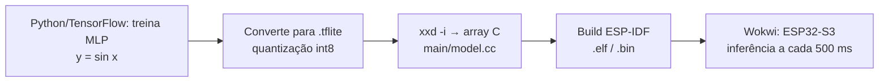

# Relatório — Hello World com TensorFlow Lite Micro no ESP32-S3

- **UC:** IA Embarcada e Modelos Compactos — Pós-graduação em IA Aplicada, UniSENAI
- **Aluno:** Renan Cardoso
- **Prática:** 4/6 — item 3 (análise do código e observações) e atividade extra (seção 8)

<!--
  ESQUELETO. Os fatos e números já preenchidos saíram do código, do build e do
  extra_mpu6050/ deste repositório. Os trechos marcados com ✍️ são seus: escreva com
  suas palavras o que observou. Apague este comentário e os ✍️ ao terminar.
-->

---

## 1. Objetivo

Reproduzir o exemplo `hello_world` do TensorFlow Lite Micro (TFLM) no ESP32-S3, com ESP-IDF v6.1 e simulação no Wokwi, e analisar como um modelo treinado em Python vira firmware que roda inferência num microcontrolador.

✍️ *Em 2–3 linhas: por que um exemplo que "só calcula seno" é útil? (dica: o seno é pretexto; o que se exercita é o pipeline treinar → quantizar → embutir → inferir).*

---

## 2. Ambiente

| Item | Versão / escolha |
|---|---|
| Placa (simulada) | ESP32-S3-DevKitC-1 no Wokwi |
| Framework | ESP-IDF v6.1.0 (`dependencies.lock`) |
| Componente de IA | `espressif/esp-tflite-micro` 1.4.1 (fixado em `main/idf_component.yml`) |
| Target | `esp32s3` (`sdkconfig.defaults`) |
| Otimização ESP-NN | Desligada para simulação (`-UESP_NN` em `main/CMakeLists.txt`) |

---

## 3. Fluxo do exemplo

O microcontrolador **não treina**: ele só executa a inferência de um modelo já treinado, gravado na flash como um vetor de bytes (`g_model`).

---

## 4. Leitura do código

| Arquivo | Papel |
|---|---|
| [`main/main.cc`](main/main.cc) | `app_main` chama `setup()` uma vez e `loop()` a cada 500 ms (`vTaskDelay`, linha 27) |
| [`main/main_functions.cc`](main/main_functions.cc) | Carrega o modelo, monta o interpretador e executa a inferência |
| [`main/model.cc`](main/model.cc) | Modelo `.tflite` como array C `g_model` (2.488 bytes, `alignas(8)`) |
| [`main/constants.h`](main/constants.h) / [`.cc`](main/constants.cc) | `kXrange = 2π`, `kInferencesPerCycle = 20` |
| [`main/output_handler.cc`](main/output_handler.cc) | Imprime `x_value` / `y_value` com `MicroPrintf` |

### 4.1 `setup()` — preparação (roda uma vez)

1. `tflite::GetModel(g_model)` ([linha 43](main/main_functions.cc:43)) — mapeia o flatbuffer sem copiar; confere a versão do schema.
2. `MicroMutableOpResolver<1>` + `AddFullyConnected()` ([linhas 51–52](main/main_functions.cc:51)) — registra **só** a operação que o modelo usa.
3. `MicroInterpreter` sobre a `tensor_arena` ([linha 57](main/main_functions.cc:57)).
4. `AllocateTensors()` ([linha 62](main/main_functions.cc:62)) — reparte a arena entre os tensores.

✍️ *Por que registrar só `FullyConnected` em vez de todas as operações (`AllOpsResolver`)? Relacione com flash ocupada.*

✍️ *Por que a arena é um vetor global de tamanho fixo e não um `malloc`? Relacione com memória estática e previsibilidade em MCU.*

### 4.2 `loop()` — uma inferência

1. Calcula `x = (inference_count / 20) · 2π` ([linhas 82–84](main/main_functions.cc:82)).
2. **Quantiza** a entrada: `x_q = x / scale + zero_point` ([linha 87](main/main_functions.cc:87)).
3. `interpreter->Invoke()` ([linha 92](main/main_functions.cc:92)).
4. **Desquantiza** a saída: `y = (y_q − zero_point) · scale` ([linha 102](main/main_functions.cc:102)).
5. `HandleOutput(x, y)` imprime o par.

✍️ *Explique com suas palavras o que são `scale` e `zero_point` (analogia: é uma normalização linear, como um `MinMaxScaler` mapeando float → int8).*

---

## 5. Resultados da simulação

Evidência: [`artefatos/02_screenshot_wokwi_hello_world.png`](artefatos/02_screenshot_wokwi_hello_world.png).

| x | sin(x) real | y do modelo (Wokwi) | Erro |
|---|---|---|---|
| 0,000 | 0,000 | 0,000000 | 0,000 |
| 1,571 (π/2) | 1,000 | 1,042060 | +0,042 |
| 3,142 (π) | 0,000 | 0,008472 | +0,008 |
| 4,712 (3π/2) | −1,000 | −1,109837 | −0,110 |

✍️ *Complete a tabela com mais 3–4 pontos do print e comente: onde o erro é maior? Por que o modelo passa de ±1, se o seno nunca passa? (dica: a rede não "sabe" que existe um limite; ela só aproxima os pontos de treino, e a quantização soma um erro de degrau.)*

---

## 6. Memória

| Recurso | Valor | Fonte |
|---|---|---|
| Modelo (`g_model_len`) | 2.488 bytes | `main/model.cc` |
| Tensor arena reservada | 2.000 bytes | `kTensorArenaSize`, [linha 35](main/main_functions.cc:35) |
| Tensor arena **usada** | ✍️ ___ bytes | `interpreter->arena_used_bytes()` |
| Imagem total do firmware | 206.988 bytes | `idf.py size` |
| DIRAM usada | 50.994 bytes (14,92 %) | `idf.py size` |

✍️ *Para medir a arena usada: após `AllocateTensors()`, adicione temporariamente `MicroPrintf("arena usada: %u bytes", (unsigned) interpreter->arena_used_bytes());`, rode no Wokwi e anote. Comente a folga em relação aos 2.000 bytes.*

✍️ *Comente a proporção: o modelo ocupa ~2,5 KB de uma imagem de ~200 KB. Quem ocupa o resto? (runtime do TFLM, FreeRTOS, drivers, logging.)*

---

## 7. Observações

### 7.1 ESP-NN e o Wokwi

O componente compila com `-DESP_NN`, que troca os kernels de referência por versões otimizadas com as instruções SIMD do ESP32-S3. O Wokwi não emula essas instruções, e com o ESP-NN ativo a simulação não funciona. A solução versionada é acrescentar `-UESP_NN` às flags do componente no `main/CMakeLists.txt`; como o `-U` vem depois do `-D` na linha de compilação, a macro fica desligada e o TFLM usa os kernels em C++.

✍️ *Descreva o que você viu quando o ESP-NN estava ligado (saída constante? reinício após `Calling app_main()`?) e o custo dessa escolha numa placa física (latência).*

### 7.2 Quantização sem arredondamento

Na [linha 87](main/main_functions.cc:87), `int8_t x_quantized = x / scale + zero_point;` converte float para `int8_t` por **truncamento**, sem `round` e sem limitar a faixa `[-128, 127]`.

✍️ *Comente o efeito: truncar em vez de arredondar gera um erro sistemático de até 1 degrau de quantização. Aqui não chega a quebrar porque `x` fica sempre dentro de `[0, 2π]`, a faixa de calibração. Uma versão robusta seria `std::clamp(std::lround(...), -128L, 127L)`.*

### 7.3 Impacto da quantização

O Hello World usa o modelo int8 já pronto do exemplo oficial; não há aqui a versão float32 para comparar. A comparação float32 × int8 foi feita no extra, com o pipeline adaptado dos scripts `train.py` / `evaluate.py` do exemplo ([`extra_mpu6050/training/`](extra_mpu6050/training/)), reproduzível com `python train.py && python eval.py`:

| Modelo (classificador MPU6050, 131 parâmetros) | Acurácia (teste) | Tamanho |
|---|---|---|
| float32 | 0,9926 | 2.716 bytes |
| int8 | 0,9926 | 3.160 bytes |

Concordância entre as previsões float32 e int8: 100%. Detalhes na seção 8.

✍️ *Comente o trade-off: aqui o int8 não perdeu acurácia, mas ficou **maior** que o float32, porque com só 131 pesos os metadados de quantização (`scale`/`zero_point`, bias int32) pesam mais que a economia de 3 bytes por peso. Em modelos maiores o int8 fica ~4× menor. Onde está então o ganho do int8 num MCU? (aritmética inteira, ESP-NN/SIMD, RAM de ativações).*

---

## 8. Parte B (extra): classificador de orientação com MPU6050

Código em [`extra_mpu6050/`](extra_mpu6050/README.md); treino reproduzível com o [guia](extra_mpu6050/GUIA_TREINO_REUSO.md).

### 8.1 Aplicação e justificativa

Monitor de postura para equipamentos que só operam com segurança numa posição (cilindros de gás, gabinetes sobre rodízios, carrinhos/AGVs, contêineres). Com o sensor parado, o acelerômetro do MPU6050 mede só a reação à gravidade, um vetor de 1 g; quando o equipamento inclina, esse vetor muda de direção nos eixos do sensor. O ângulo θ entre o vetor e o eixo +Z define as classes:

| Classe | θ | Ação no campo |
|---|---|---|
| `REPOUSO` | 0° a 30° | Nenhuma; telemetria periódica |
| `INCLINADO` | 30° a 120° | Alerta: inspeção, notificar operador |
| `INVERTIDO` | 120° a 180° | Alarme: parar processo, buzzer/LED, evento urgente |

**Por que na borda:** decisão em milissegundos no próprio dispositivo, funciona sem rede (só o evento sobe, não o fluxo bruto do sensor) e o MCU pode dormir entre leituras. É o eixo Cloud → Edge → TinyML da aula 1.

**Limitação declarada:** os rótulos vêm de uma regra física conhecida (`θ = acos(az/|a|)` com limiares); um `if` resolveria sem rede neural. O valor do exercício está em (1) percorrer o pipeline completo com um sensor real (dataset → treino → int8 → array C → inferência no MCU) e (2) deixar pronto o molde para trocar o dataset sintético por dados coletados (vibração, gestos, manutenção preditiva da aula 6), onde não existe regra fechada.

### 8.2 Dataset e modelo

- **Dataset:** 1.800 leituras sintéticas `(ax, ay, az)` em g, 600 por classe, com θ uniforme dentro de cada faixa, módulo `N(1; 0,03)` e ruído `N(0; 0,02 g)` por eixo. O rótulo vem do θ real, antes do ruído, o que cria ambiguidade realista perto das fronteiras. Split estratificado 70/15/15.
- **Modelo:** MLP 3 → 8 → 8 → 3 (ReLU, softmax), 131 parâmetros, 200 épocas, quantização pós-treino full-integer (int8). A fronteira θ = 30° é um cone em volta de +Z, não linearmente separável em `(ax, ay, az)`; por isso as camadas ocultas.
- **Scripts:** [`train.py`](extra_mpu6050/training/train.py) e [`eval.py`](extra_mpu6050/training/eval.py) seguem a estrutura do `train.py`/`evaluate.py` do exemplo oficial, trocando regressão por classificação e incluindo a quantização e a geração do array C (substitui o `xxd -i`, ausente no Windows).

### 8.3 Resultados do treino

| Modelo | Acurácia (teste, 270 amostras) | Tamanho |
|---|---|---|
| float32 | 0,9926 | 2.716 bytes |
| int8 | 0,9926 | 3.160 bytes |

- **Concordância float32 × int8:** 100%; a quantização não mudou nenhuma previsão.
- **Onde erra:** os 2 erros ficam colados nas fronteiras de 30° e 120° ([`eval_plots.png`](extra_mpu6050/training/models/eval_plots.png)): é a ambiguidade criada pelo ruído.
- **O int8 ficou maior que o float32:** ver a discussão da seção 7.3.

### 8.4 Resultados no ESP32-S3

**Memória (`idf.py size`, target `esp32s3`):**

| Recurso | Valor |
|---|---|
| Binário da aplicação | 243.824 bytes (77% da partição de 1 MB livre) |
| Flash Code / Flash Data | 116.622 / 60.420 bytes |
| DIRAM | 57.738 bytes (16,89%) |
| Modelo (`g_model`) | 3.160 bytes (~1,3% do binário) |
| Tensor arena usada / reservada | 988 / 4.096 bytes |

O modelo é uma fração mínima do binário; o resto é o runtime do TFLM, FreeRTOS, drivers e logging, a mesma proporção do Hello World. Com ~20% de folga, uma arena de 1.200 bytes bastaria, devolvendo ~2,9 KB de SRAM; ficou em 4 KB como margem para retreinos com camadas maiores.

**Verificação no Wokwi** ([boot](artefatos/04_screenshot_extra_wokwi_boot_self_test.png) e [varredura](artefatos/03_screenshot_extra_wokwi_sensor_mpu6050.png)):

| Verificação | Esperado (`eval.py`) | Observado |
|---|---|---|
| `WHO_AM_I` | `0x68` | ✅ `0x68` |
| Quantização input / output | `0.00851128, -1` / `0.00390625, -128` | ✅ idênticos |
| Self-test 0° | `in_q=[-1, -1, 116] out_q=[127, -128, -128]` → `REPOUSO` | ✅ idêntico |
| Self-test 45° | `in_q=[82, -1, 82] out_q=[-128, 127, -128]` → `INCLINADO` | ✅ idêntico |
| Self-test 90° | `in_q=[116, -1, -1] out_q=[-128, 127, -128]` → `INCLINADO` | ✅ idêntico |
| Self-test 180° | `in_q=[-1, -1, -118] out_q=[-128, -128, 127]` → `INVERTIDO` | ✅ idêntico |

O self-test bate com o `eval.py` **byte a byte** nos 4 vetores. Isso prova que o modelo no ESP32-S3 é exatamente o `.tflite` avaliado no PC: a conversão para array C, a quantização da entrada no firmware (`round` + `clamp`, corrigindo o truncamento da seção 7.2) e os kernels de referência do TFLM não introduziram diferença.

**Varredura do eixo Z** (X = Y = 0, Z de +1 g a −2 g):

| Z (g) | Classe (confiança) | Evento |
|---|---|---|
| 1,00 · 0,60 | `REPOUSO` (100% / 99%) | — |
| 0,30 | `INCLINADO` (100%) | `W >>> ALERTA` |
| 0,15 · 0,00 · −0,15 · −0,35 | `INCLINADO` (98–100%) | — |
| −1,55 | `INVERTIDO` (100%) | `E >>> ALARME` |
| −1,80 · −2,00 | `INVERTIDO` (100%) | — |

As 3 classes aparecem no dispositivo, e o evento sai uma única vez, na transição, com o nível de log certo (`W` para alerta, `E` para alarme).

### 8.5 Achado: leitura fora da distribuição de treino

Mexer só em Z muda o **módulo** do vetor, não a direção: com X = Y = 0 ele aponta sempre para +Z ou −Z. Com Z entre 0,15 e 0,3 g o vetor aponta para +Z (θ = 0°), e pela regra seria `REPOUSO`, mas o modelo respondeu `INCLINADO` com 100% de confiança.

Não é bug de firmware, é limite do modelo: o dataset só tem leituras com módulo perto de 1 g, e uma MLP não sabe dizer "não sei"; fora da distribuição ela extrapola, e com confiança alta. É o mesmo fenômeno do Hello World passando de ±1 (seção 5). Fisicamente, um acelerômetro parado sempre mede ~1 g; módulo bem abaixo disso significa queda livre ou aceleração, e a pergunta "qual a orientação?" nem se aplica.

Correções possíveis, em ordem de custo:

1. **Validação de entrada no firmware, sem retreino:** se `| |a| − 1 g | > 0,3 g`, reportar `MOVIMENTO/QUEDA` e não classificar.
2. **Normalizar o vetor** (`a / |a|`) no treino e no firmware, para o modelo ver só a direção; exige retreino e o mesmo pré-processamento nos dois lados.
3. **4ª classe `MOVIMENTO`** no dataset, com módulos fora de 1 g; exige retreino.

### 8.6 Outras observações

- **Target errado → `Checksum failure`:** a extensão do ESP-IDF assumiu `esp32` ao abrir a pasta nova, ignorando o `sdkconfig.defaults`. O bootloader foi gerado para `0x1000`, mas a ROM do ESP32-S3 o procura em `0x0`, e o boot parou em `ets_main.c 329`. Corrigido com `idf.py set-target esp32s3`.
- **Driver I2C legado:** o boot mostra `W i2c: This driver is an old driver...`. Vem do `espressif/mpu6050` 1.2.1, que usa `driver/i2c.h`; funciona na v6.1, mas o próximo passo seria migrar para `driver/i2c_master.h`.
- **Hardware em C, TFLM em C++:** o driver do sensor ficou em C porque o C++ não aceita o inicializador designado aninhado (`.master.clk_speed`) do I2C; o C++ aparece só onde o TFLM exige, com `extern "C"` na fronteira.

✍️ *Comente com suas palavras: o que o self-test idêntico prova, e por que um modelo com 99% de acurácia ainda precisa de validação de entrada no dispositivo (seção 8.5).*

---

## 9. Conclusão

O exemplo `hello_world` foi reproduzido no ESP32-S3 com ESP-IDF v6.1 e simulado no Wokwi, e a senoide aproximada pelo modelo int8 apareceu no monitor serial. O ESP-NN precisou ser desligado com `-UESP_NN` no `main/CMakeLists.txt`, uma solução versionada que não depende de editar `managed_components/`. No extra, o mesmo pipeline foi aplicado a um problema novo: um classificador de orientação com MPU6050, treinado do zero com `train.py`/`eval.py` adaptados do exemplo oficial. O modelo final tem 131 parâmetros, 3.160 bytes na flash e 988 bytes de arena, e teve a mesma acurácia em float32 e em int8 (99,26%).

A principal lição é que o caminho Python → MCU é um **contrato** entre os dois lados. Ordem das classes, número de features, unidade física da entrada, parâmetros de quantização, operações registradas no op resolver e tamanho da arena precisam ser iguais no treino e no firmware, e um erro em qualquer um deles compila sem aviso e classifica errado. O self-test no boot, com saída idêntica byte a byte à do `eval.py`, foi a forma de provar que esse contrato foi cumprido. A segunda lição é que acurácia no conjunto de teste não garante comportamento em campo. No Wokwi, leituras com módulo longe de 1 g, fora da distribuição de treino, foram classificadas com 100% de confiança numa classe errada (seção 8.5). O modelo embarcado precisa de validação de entrada, porque ele não sabe dizer "não sei". Por fim, os números de memória mostram onde está o custo real: o modelo ocupa cerca de 1% do binário, e o resto é o runtime do TFLM e o sistema.
