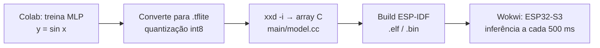

# Relatório — Hello World com TensorFlow Lite Micro no ESP32-S3

- **UC:** IA Embarcada e Modelos Compactos — Pós-graduação em IA Aplicada, UniSENAI
- **Aluno:** Renan Cardoso
- **Prática:** 4/6 — Parte A, item 3 (análise do código e observações)

<!--
  ESQUELETO. Os fatos e números já preenchidos saíram do código, do build e do
  notebook deste repositório. Os trechos marcados com ✍️ são seus: escreva com
  suas palavras o que observou. Apague este comentário e os ✍️ ao terminar.
-->

---

## 1. Objetivo

Reproduzir o exemplo `hello_world` do TensorFlow Lite Micro (TFLM) no ESP32-S3, com ESP-IDF v6.1 e simulação no Wokwi, e analisar como um modelo treinado em Python vira firmware que roda inferência num microcontrolador.

✍️ *Em 2–3 linhas: por que um exemplo que "só calcula seno" é útil? (dica: o seno é pretexto; o que se exercita é o pipeline treinar → quantizar → embutir → inferir).*

---

## 2. Ambiente

| Item | Versão / escolha |
|---|---|
| Placa (simulada) | ESP32-S3-DevKitC-1 no Wokwi |
| Framework | ESP-IDF v6.1.0 (`dependencies.lock`) |
| Componente de IA | `espressif/esp-tflite-micro` 1.4.1 (fixado em `main/idf_component.yml`) |
| Target | `esp32s3` (`sdkconfig.defaults`) |
| Otimização ESP-NN | Desligada para simulação (`-UESP_NN` em `main/CMakeLists.txt`) |

---

## 3. Fluxo do exemplo

O microcontrolador **não treina**: ele só executa a inferência de um modelo já treinado, gravado na flash como um vetor de bytes (`g_model`).

---

## 4. Leitura do código

| Arquivo | Papel |
|---|---|
| [`main/main.cc`](main/main.cc) | `app_main` chama `setup()` uma vez e `loop()` a cada 500 ms (`vTaskDelay`, linha 27) |
| [`main/main_functions.cc`](main/main_functions.cc) | Carrega o modelo, monta o interpretador e executa a inferência |
| [`main/model.cc`](main/model.cc) | Modelo `.tflite` como array C `g_model` (2.488 bytes, `alignas(8)`) |
| [`main/constants.h`](main/constants.h) / [`.cc`](main/constants.cc) | `kXrange = 2π`, `kInferencesPerCycle = 20` |
| [`main/output_handler.cc`](main/output_handler.cc) | Imprime `x_value` / `y_value` com `MicroPrintf` |

### 4.1 `setup()` — preparação (roda uma vez)

1. `tflite::GetModel(g_model)` ([linha 43](main/main_functions.cc:43)) — mapeia o flatbuffer sem copiar; confere a versão do schema.
2. `MicroMutableOpResolver<1>` + `AddFullyConnected()` ([linhas 51–52](main/main_functions.cc:51)) — registra **só** a operação que o modelo usa.
3. `MicroInterpreter` sobre a `tensor_arena` ([linha 57](main/main_functions.cc:57)).
4. `AllocateTensors()` ([linha 62](main/main_functions.cc:62)) — reparte a arena entre os tensores.

✍️ *Por que registrar só `FullyConnected` em vez de todas as operações (`AllOpsResolver`)? Relacione com flash ocupada.*

✍️ *Por que a arena é um vetor global de tamanho fixo e não um `malloc`? Relacione com memória estática e previsibilidade em MCU.*

### 4.2 `loop()` — uma inferência

1. Calcula `x = (inference_count / 20) · 2π` ([linhas 82–84](main/main_functions.cc:82)).
2. **Quantiza** a entrada: `x_q = x / scale + zero_point` ([linha 87](main/main_functions.cc:87)).
3. `interpreter->Invoke()` ([linha 92](main/main_functions.cc:92)).
4. **Desquantiza** a saída: `y = (y_q − zero_point) · scale` ([linha 102](main/main_functions.cc:102)).
5. `HandleOutput(x, y)` imprime o par.

✍️ *Explique com suas palavras o que são `scale` e `zero_point` (analogia: é uma normalização linear, como um `MinMaxScaler` mapeando float → int8).*

---

## 5. Resultados da simulação

Evidência: [`artefatos/02_screenshot_wokwi_hello_world.png`](artefatos/02_screenshot_wokwi_hello_world.png).

| x | sin(x) real | y do modelo (Wokwi) | Erro |
|---|---|---|---|
| 0,000 | 0,000 | 0,000000 | 0,000 |
| 1,571 (π/2) | 1,000 | 1,042060 | +0,042 |
| 3,142 (π) | 0,000 | 0,008472 | +0,008 |
| 4,712 (3π/2) | −1,000 | −1,109837 | −0,110 |

✍️ *Complete a tabela com mais 3–4 pontos do print e comente: onde o erro é maior? Por que o modelo passa de ±1, se o seno nunca passa? (dica: a rede não "sabe" que existe um limite; ela só aproxima os pontos de treino, e a quantização soma um erro de degrau.)*

---

## 6. Memória

| Recurso | Valor | Fonte |
|---|---|---|
| Modelo (`g_model_len`) | 2.488 bytes | `main/model.cc` |
| Tensor arena reservada | 2.000 bytes | `kTensorArenaSize`, [linha 35](main/main_functions.cc:35) |
| Tensor arena **usada** | ✍️ ___ bytes | `interpreter->arena_used_bytes()` |
| Imagem total do firmware | 206.988 bytes | `idf.py size` |
| DIRAM usada | 50.994 bytes (14,92 %) | `idf.py size` |

✍️ *Para medir a arena usada: após `AllocateTensors()`, adicione temporariamente `MicroPrintf("arena usada: %u bytes", (unsigned) interpreter->arena_used_bytes());`, rode no Wokwi e anote. Comente a folga em relação aos 2.000 bytes.*

✍️ *Comente a proporção: o modelo ocupa ~2,5 KB de uma imagem de ~200 KB. Quem ocupa o resto? (runtime do TFLM, FreeRTOS, drivers, logging.)*

---

## 7. Observações

### 7.1 ESP-NN e o Wokwi

O componente compila com `-DESP_NN`, que troca os kernels de referência por versões otimizadas com as instruções SIMD do ESP32-S3. O Wokwi não emula essas instruções, e com o ESP-NN ativo a simulação não funciona. A solução versionada é acrescentar `-UESP_NN` às flags do componente no `main/CMakeLists.txt`; como o `-U` vem depois do `-D` na linha de compilação, a macro fica desligada e o TFLM usa os kernels em C++.

✍️ *Descreva o que você viu quando o ESP-NN estava ligado (saída constante? reinício após `Calling app_main()`?) e o custo dessa escolha numa placa física (latência).*

### 7.2 Quantização sem arredondamento

Na [linha 87](main/main_functions.cc:87), `int8_t x_quantized = x / scale + zero_point;` converte float para `int8_t` por **truncamento**, sem `round` e sem limitar a faixa `[-128, 127]`.

✍️ *Comente o efeito: truncar em vez de arredondar gera um erro sistemático de até 1 degrau de quantização. Aqui não chega a quebrar porque `x` fica sempre dentro de `[0, 2π]`, a faixa de calibração. Uma versão robusta seria `std::clamp(std::lround(...), -128L, 127L)`.*

### 7.3 Impacto da quantização (Colab)

O notebook [`notebooks/tflite_hello_world_training.ipynb`](notebooks/tflite_hello_world_training.ipynb) retreinou o modelo e comparou float32 × int8:

| Modelo | MAE | RMSE |
|---|---|---|
| float32 | 0,0134 | 0,0181 |
| int8 | 0,0187 | 0,0233 |
| Δ (int8 − float) | +0,0053 | +0,0053 |

> ⚠️ **Atenção à coerência:** o notebook treina uma rede **1 → 32 → 32 → 1 (1.153 parâmetros)**, mas o firmware roda o modelo original do exemplo, **1 → 16 → 16 → 1 (321 parâmetros)**. Os números acima **não são** do modelo que está no Wokwi. Escolha uma saída:
> - (a) embarcar o modelo retreinado (`xxd -i hello_world_int8.tflite` → `main/model.cc`) e refazer o print; ou
> - (b) manter o modelo original e deixar explícito aqui que as métricas são de uma variante maior treinada no Colab.

✍️ *Comente o trade-off: int8 deixa o modelo ~4× menor que float32 ao custo de +0,005 de MAE. Vale a pena num MCU?*

---

## 8. Conclusão

✍️ *3–5 linhas: o que funcionou, o que aprendeu sobre o caminho Python → MCU, e o que faria diferente numa aplicação real (ex.: ligar o ESP-NN na placa física, medir latência por inferência, dimensionar a arena pelo uso medido).*
