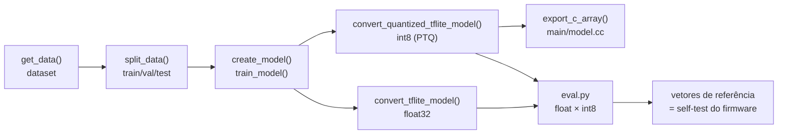

# Guia: reproduzir o treino e reusar `train.py` / `eval.py` em outro projeto

Este guia serve para duas coisas:

1. **Reproduzir** exatamente os resultados do classificador de orientação (MPU6050).
2. **Reaproveitar** os dois scripts num novo projeto ESP-IDF + TFLite Micro, com outro sensor, outro dataset ou outras classes.

Os scripts seguem a estrutura do [`train.py`](https://github.com/tensorflow/tflite-micro/blob/main/tensorflow/lite/micro/examples/hello_world/train.py) e do [`evaluate.py`](https://github.com/tensorflow/tflite-micro/blob/main/tensorflow/lite/micro/examples/hello_world/evaluate.py) do `hello_world` oficial: mesmas funções (`get_data`, `create_model`, `convert_tflite_model`, `train_model`, `get_tflm_prediction`, `get_tflite_prediction`) e mesma linha de comando com `argparse`. Quem leu o exemplo do professor reconhece cada bloco.

---

## 1. O pipeline em uma figura



| Etapa do hello_world | Onde está aqui | O que mudou |
|---|---|---|
| `train.py` | `train.py` | Classificação (softmax) em vez de regressão |
| `ptq.py` (quantização) | `train.py` → `convert_quantized_tflite_model` | Tudo num script só |
| `xxd -i model.tflite > model.cc` | `train.py` → `export_c_array` | Em Python: funciona no Windows, que não tem `xxd` |
| `evaluate.py` | `eval.py` | Acurácia, matriz de confusão e vetores de referência, em vez de MAE |

---

## 2. Preparar o ambiente

### Opção A: local no Windows (validada)

O TensorFlow instalado no Python global pode quebrar por conflito de `protobuf` com outros pacotes. Use um **venv só para isso**, em **caminho curto**: o Windows limita caminhos a 260 caracteres, e o TensorFlow dentro de uma pasta profunda falha com `DLL load failed ... nome do arquivo ou extensão muito grande`.

```powershell
python -m venv C:\Users\reyna\.venvs\tf-mpu6050
```

```powershell
C:\Users\reyna\.venvs\tf-mpu6050\Scripts\python -m pip install -r training\requirements.txt
```

Nos comandos abaixo, `PY` é `C:\Users\reyna\.venvs\tf-mpu6050\Scripts\python`.

### Opção B: Google Colab

```python
# 1. Envie a pasta training/ (ou clone o repositório) e entre nela
%cd /content/extra_mpu6050/training
# 2. Treine gravando o model.cc na própria pasta (não existe ../main no Colab avulso)
!python train.py --model_cc model.cc
!python eval.py
# 3. Baixe model.cc e models/ e copie o model.cc para main/ do projeto ESP-IDF
```

No Colab dá para instalar o runtime do TFLM (`!pip install tflite-micro`). Com ele, o `eval.py` roda **o mesmo interpretador do firmware**, em vez do LiteRT.

---

## 3. Reproduzir os resultados

A partir da pasta `training/`:

```powershell
PY train.py
```

```powershell
PY eval.py
```

### O que deve sair (seed 42, 200 épocas, TF 2.21.0)

| Item | Valor esperado | Arquivo |
|---|---|---|
| Amostras (train/val/test) | 1.800 (1.260 / 270 / 270) | `models/train_summary.json` |
| Parâmetros | 131 | idem |
| Ops do modelo int8 | `FULLY_CONNECTED`, `SOFTMAX` | idem |
| Tamanho float32 / int8 | 2.716 / 3.160 bytes | idem |
| Acurácia float32 / int8 | 0,9926 / 0,9926 | `models/eval_report.json` |
| Concordância float × int8 | 1,0000 | idem |
| Quantização da entrada | `scale=0.00851128`, `zero_point=-1` | saída do `eval.py` |

**Sobre reprodutibilidade:** o **dataset** é idêntico bit a bit com a mesma `--seed`, porque é gerado com `numpy.random.default_rng`. Os **pesos** podem variar na última casa decimal entre máquinas, versões do TF ou CPU e GPU, porque a soma em ponto flutuante não é associativa. Por isso:

- a acurácia pode oscilar cerca de ±0,5 ponto percentual;
- `scale`/`zero_point` e os vetores de referência podem mudar um pouco.

O que precisa bater é **o `eval.py` com o firmware compilado a partir do mesmo `model.cc`**, e não a sua máquina com a minha.

### Arquivos gerados

```
training/
├── data/mpu6050_orientacao.csv   # dataset com a coluna split (train/val/test)
└── models/
    ├── orientacao_float.tflite   # referência float32
    ├── orientacao_int8.tflite    # o que vai para o MCU
    ├── train_summary.json        # hiperparâmetros, tamanhos, ops, versão do TF
    ├── eval_report.json          # métricas + vetores de referência
    └── eval_plots.png            # confusão float/int8 + acurácia por faixa de θ
main/model.cc                     # array g_model (gerado; não editar)
```

Versione todos esses arquivos. São a prova de que o `model.cc` embarcado saiu desse treino.

### Flags úteis

| Script | Flag | Uso |
|---|---|---|
| `train.py` | `--epochs 300` | Mais épocas |
| `train.py` | `--samples_per_class 1000` | Dataset maior |
| `train.py` | `--seed 7` | Outro sorteio; teste de robustez |
| `train.py` | `--model_cc caminho/model.cc` | Onde gravar o array C |
| `train.py` | `--save_tf_model` | Salva também o `model.keras` |
| `eval.py` | `--use_tflite` | Força o LiteRT/TFLite mesmo com o `tflite-micro` instalado |
| `eval.py` | `--no-plot` | Não gera o PNG |

---

## 4. Conferir o firmware contra o `eval.py`

É o passo que prova que o modelo no chip é o mesmo avaliado no PC:

1. O `eval.py` imprime `in_q` e `out_q` para 4 vetores fixos (`GOLDEN_VECTORS`).
2. O firmware roda **os mesmos 4 vetores** no boot (`kGoldenVectors` em `main/main.cc`) e imprime `in_q`/`out_q` no monitor serial.
3. Os números têm que ser **idênticos**. Se não forem, o `model.cc` compilado não é o do último treino: rode `train.py` de novo e faça rebuild.

---

## 5. Reusar em outro projeto

### 5.1 Copiar

```
novo_projeto/
├── main/
│   ├── model.h                      # copie (declara g_model / g_model_len)
│   ├── orientation_classifier.*     # copie e renomeie (ex.: gesture_classifier.*)
│   └── ...
└── training/
    ├── train.py                     # copie
    ├── eval.py                      # copie
    └── requirements.txt             # copie
```

O `--model_cc` padrão é `../main/model.cc`. Com essa estrutura, nada muda.

### 5.2 Pontos de adaptação no Python

| O que muda | Onde | Exemplo: gesto com acelerômetro + giroscópio |
|---|---|---|
| Nomes e ordem das classes | `CLASSES` (`train.py`) | `["PARADO", "CHACOALHAR", "GIRAR"]` |
| Número de features | `NUM_FEATURES` (`train.py`) | `6` (ax, ay, az, gx, gy, gz), ou `6 × janela` se usar janela temporal |
| Como o dado nasce | `get_data()` (`train.py`) | Ler um CSV coletado, em vez de sintetizar (ver 5.4) |
| Colunas do CSV | `save_dataset_csv()` e `load_split()` | Uma coluna por feature |
| Arquitetura | `create_model()` | Mais neurônios, `Conv1D` para janelas; **toda camada nova é uma op nova no firmware** |
| Tarefa | `create_model()` → `loss` / ativação final | Regressão: `Dense(1)` + `mse` (volta ao hello_world) |
| Vetores de teste | `GOLDEN_VECTORS` (`eval.py`) | 1 exemplo típico por classe |
| Faixa física do sensor | Dados usados no `representative_dataset` | Precisam cobrir a faixa real, senão o int8 satura |

### 5.3 Pontos de adaptação no firmware (o contrato Python ↔ C)

Tudo o que o Python decide, o C precisa repetir. Um valor errado aqui **compila sem erro e classifica errado**.

| Python (`train.py` / `eval.py`) | Firmware | Verificação |
|---|---|---|
| `CLASSES` (ordem) | `kLabels[]`, `kNumClasses` | Mesma ordem, mesmo tamanho |
| `NUM_FEATURES` | `kNumFeatures` | O `classifier_init()` confere as dims e aborta se divergir |
| Unidades do dataset (g, °/s, °C...) | Unidade que o driver devolve | Aqui ambos em **g**; o fundo de escala do sensor não pode saturar antes da faixa do dataset |
| Pré-processamento (normalização, janela, FFT) | Código C **idêntico** antes do `classifier_predict` | Este projeto não normaliza, de propósito, para não ter o que duplicar |
| `int8_ops` em `train_summary.json` | `MicroMutableOpResolver<N>` + `AddXxx()` | N = número de ops |
| Tamanho das ativações | `kTensorArenaSize` | Rode uma vez, leia `arena usada` no log e deixe cerca de 20% de folga |
| `GOLDEN_VECTORS` | `kGoldenVectors` | Self-test idêntico ao `eval.py` |

### 5.4 Trocar o dataset sintético por dados reais

Este é o caminho natural para o **Projeto Final**:

1. **Coletar.** Adicione um modo de log no firmware que imprima só `DATA,ax,ay,az` a cada leitura. Para cada classe, posicione o sensor (placa real, ou os sliders do Wokwi) e grave o monitor serial num arquivo.
2. **Montar o CSV** com as colunas `ax_g,ay_g,az_g,label`.
3. **Trocar o `get_data()`** por um leitor desse CSV que devolva `(x_values, y_values, theta_deg)`. Sem θ disponível, devolva um vetor de zeros e ignore o terceiro gráfico do `eval.py`.
4. **Separar o teste por sessão de coleta**, e não por amostra aleatória. Leituras vizinhas no tempo são quase iguais: sorteá-las entre treino e teste infla a acurácia (vazamento de dados, o mesmo *leakage* da ciência de dados).

---

## 6. Problemas comuns

| Sintoma | Causa | Correção |
|---|---|---|
| `VersionError: ... Protobuf Gencode/Runtime` | TF do Python global conflitando com outro pacote | Use o venv da seção 2 |
| `DLL load failed ... muito grande` | Caminho do venv longo demais | venv em caminho curto (`C:\Users\<você>\.venvs\...`) |
| `UserWarning: tf.lite.Interpreter is deprecated` | TF ≥ 2.20 | Inofensivo; instale `ai-edge-litert` onde houver wheel (Linux/Colab) e o `eval.py` passa a usá-lo |
| `Statistics for quantized inputs were expected` | Aviso do conversor int8 | Inofensivo; a calibração vem do `representative_dataset` |
| Acentos aparecem como `�` no terminal | Console do Windows em cp1252 | `$env:PYTHONIOENCODING = "utf-8"` antes de rodar |
| `ModuleNotFoundError: train` ao rodar `eval.py` | `eval.py` separado do `train.py` | Mantenha os dois na mesma pasta: o `eval.py` importa `CLASSES` do `train.py`, a fonte única da verdade |
