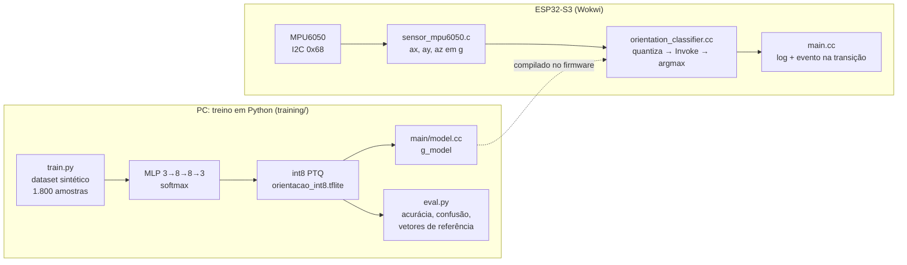

# Classificador de orientação com MPU6050 e TFLite Micro

Atividade extra da Prática 4/6 (IA Embarcada e Modelos Compactos, UniSENAI). Um MPU6050 lido por I2C alimenta um modelo int8 que roda no ESP32-S3 e classifica a orientação de um equipamento em **REPOUSO**, **INCLINADO** ou **INVERTIDO**.

- **Novo sensor:** MPU6050 (acelerômetro, I2C `0x68`)
- **Novo dataset:** 1.800 leituras sintéticas do acelerômetro, rotuladas pela inclinação
- **Novo treino:** MLP 3 → 8 → 8 → 3, treinada do zero e quantizada em int8

A visão geral da entrega está no [README principal](../README.md) e a análise completa na seção 8 do [relatório](../RELATORIO.md).

---

## Aplicação

Monitor de postura para equipamentos que só operam com segurança numa posição: cilindros de gás, gabinetes sobre rodízios, carrinhos/AGVs, contêineres. Parado, o acelerômetro mede só a gravidade (1 g); quando o equipamento inclina, esse vetor muda de direção nos eixos do sensor. O ângulo entre o vetor e o eixo +Z é a inclinação θ.

| Classe | θ | Significado | Ação |
|---|---|---|---|
| `REPOUSO` | 0° a 30° | Posição de operação | Só telemetria |
| `INCLINADO` | 30° a 120° | Base cedendo, carga desbalanceada, de lado | **Alerta**: inspeção |
| `INVERTIDO` | 120° a 180° | Tombou ou capotou | **Alarme**: parar, buzzer/LED |

O evento (`>>> ALERTA`, `>>> ALARME`) sai **só na transição** de estado, que é o que uma aplicação real publicaria via MQTT.

---

## Arquitetura



| Arquivo | Papel |
|---|---|
| [`main/main.cc`](main/main.cc) | `app_main`: inicializa sensor e modelo, roda o self-test e o laço de leitura/inferência |
| [`main/sensor_mpu6050.c`](main/sensor_mpu6050.c) | I2C e MPU6050 em **C** (mesmo fluxo da prática 2), exposto ao C++ via `extern "C"` |
| [`main/orientation_classifier.cc`](main/orientation_classifier.cc) | TFLM em C++: op resolver, arena, quantização (`round` + `clamp`), argmax |
| [`main/model.cc`](main/model.cc) | **Gerado** pelo `train.py`; não edite à mão |
| [`main/Kconfig.projbuild`](main/Kconfig.projbuild) | Pinos SDA/SCL, frequência do I2C, período de inferência |
| [`training/train.py`](training/train.py) | Dataset, treino, conversão float32/int8 e geração do `model.cc` |
| [`training/eval.py`](training/eval.py) | Métricas float32 × int8, gráficos, vetores de referência |

**Circuito ([`diagram.json`](diagram.json)):** MPU6050 VCC → 3V3, GND → GND, SDA → GPIO8, SCL → GPIO9.

---

## Resultados

| Item | Valor |
|---|---|
| Acurácia no teste (float32 / int8) | 0,9926 / 0,9926 (concordância de 100%) |
| Modelo na flash | 3.160 bytes |
| Tensor arena usada / reservada | 988 / 4.096 bytes |
| Operações | `FULLY_CONNECTED`, `SOFTMAX` |
| Binário da aplicação | 243.824 bytes |
| Self-test no ESP32-S3 × `eval.py` | Idênticos nos 4 vetores |

Métricas em [`training/models/eval_report.json`](training/models/eval_report.json) e [`eval_plots.png`](training/models/eval_plots.png). Evidências do Wokwi em [`../artefatos/`](../artefatos/).

---

## Como rodar

### 1. (Opcional) Retreinar

O `main/model.cc` já está gerado e versionado. Para mudar o dataset ou o modelo, siga o [guia de reprodução e reuso](GUIA_TREINO_REUSO.md).

### 2. Build

Abra **esta pasta** (`extra_mpu6050/`) no VS Code, como projeto separado do `hello_world`. Confira se a barra de status mostra **`esp32s3`**: ao abrir uma pasta nova, a extensão pode assumir `esp32`. Se for o caso, com o ambiente do ESP-IDF ativado:

```bash
idf.py set-target esp32s3
```

```bash
idf.py build
```

### 3. Simular

Abra o `diagram.json` → `Wokwi: Start Simulation`. Clique no MPU6050 e mova os sliders de aceleração:

| Sliders (X, Y, Z) | Classe esperada |
|---|---|
| 0, 0, 1 | `REPOUSO` |
| 1, 0, 0 | `INCLINADO` + `>>> ALERTA` |
| 0, 0, −1 | `INVERTIDO` + `>>> ALARME` |

Use leituras com módulo perto de 1 g: é o que um sensor parado mede e o que o modelo viu no treino.

### Saída esperada no boot

Os valores do self-test **precisam bater** com a saída do `python eval.py`:

```
I (266) sensor_mpu6050: MPU6050 WHO_AM_I: 0x68 (esperado: 0x68)
I (266) classifier: Modelo: 3160 bytes | arena usada: 988 de 4096 bytes
I (286) orientacao: plana, face p/ cima (0 graus)   in_q=[-1, -1, 116] out_q=[127, -128, -128] -> REPOUSO
I (296) orientacao: inclinada 45 graus              in_q=[82, -1, 82]  out_q=[-128, 127, -128] -> INCLINADO
I (306) orientacao: de lado (90 graus)              in_q=[116, -1, -1] out_q=[-128, 127, -128] -> INCLINADO
I (316) orientacao: de cabeca p/ baixo (180 graus)  in_q=[-1, -1, -118] out_q=[-128, -128, 127] -> INVERTIDO
I (336) orientacao: ACC[g] x=  0.00 y=  0.00 z=  1.00 -> REPOUSO   (100%)
I (336) orientacao: >>> Estado: REPOUSO (operação normal)
```

---

## Problemas comuns

| Sintoma | Causa | Correção |
|---|---|---|
| `Checksum failure` + `ets_main.c 329` no boot | Firmware compilado para `esp32` | `idf.py set-target esp32s3` e rebuild |
| `driver/i2c.h: No such file or directory` | `espressif/mpu6050` sem `driver` no REQUIRES | Já tratado no [`main/CMakeLists.txt`](main/CMakeLists.txt) (`target_link_libraries(... idf::driver)`) |
| Classe travada no Wokwi | ESP-NN ligado | Confira o `-UESP_NN` no `main/CMakeLists.txt` e faça Full Clean |
| `AllocateTensors() falhou` | Arena pequena | Aumente `kTensorArenaSize` em `orientation_classifier.cc` |
| `Didn't find op for builtin opcode` | Operação não registrada | Compare com `int8_ops` em `training/models/train_summary.json` |
| Self-test diferente do `eval.py` | `model.cc` de outro treino | Rode `train.py` e `eval.py` de novo e rebuild |
| `WHO_AM_I` falha | Fiação ou pinos | SDA=8/SCL=9 no `diagram.json` e no `menuconfig` |
