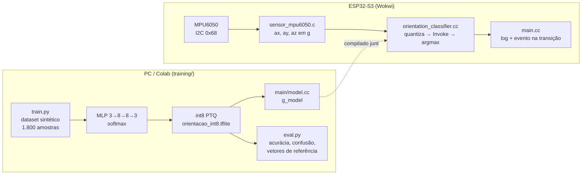

# Prática 4 (extra): classificador de orientação com MPU6050 e TFLite Micro

- **UC:** IA Embarcada e Modelos Compactos (Pós-graduação em IA Aplicada, UniSENAI)
- **Aluno:** Renan Cardoso
- **Requisito do extra:** nova aplicação, com **novo sensor** (MPU6050), **novo dataset** (leituras sintéticas do acelerômetro) e **novo treino** (classificador de 3 classes treinado do zero). A base é o pipeline do `hello_world`, mas não é outro exemplo do `esp-tflite-micro`.

---

## A aplicação

### O problema

Muitos equipamentos só funcionam com segurança numa posição. Alguns exemplos:

- cilindros de gás;
- gabinetes e quadros elétricos sobre rodízios;
- carrinhos e AGVs de logística;
- contêineres de resíduos;
- painéis e sensores instalados em poste.

Quando um desses equipamentos inclina ou tomba, alguém precisa saber **rápido**, e de preferência sem depender de uma câmera nem da nuvem.

### Por que o MPU6050 resolve

O MPU6050 é uma IMU de 6 eixos (acelerômetro e giroscópio) ligada por **I2C**. Com o sensor parado, o acelerômetro mede apenas a **reação à gravidade**: um vetor de 1 g apontando "para cima". Quando o equipamento inclina, esse vetor muda de **direção** nos eixos do sensor.

- Com a placa deitada, de face para cima, a leitura é `(ax, ay, az) ≈ (0, 0, +1) g`.
- De cabeça para baixo, a leitura é `≈ (0, 0, −1) g`.

O ângulo entre o vetor medido e o eixo +Z é a **inclinação θ**.

### As classes e o uso de cada uma

| Classe | Faixa de θ | Significado no campo | Ação típica |
|---|---|---|---|
| `REPOUSO` | 0° a 30° | Equipamento na posição de operação | Nenhuma; só telemetria periódica |
| `INCLINADO` | 30° a 120° | Base cedendo, carga desbalanceada, equipamento deitado de lado (90°) | **Alerta**: agendar inspeção, notificar o operador |
| `INVERTIDO` | 120° a 180° | Equipamento tombou ou capotou | **Alarme**: parar o processo, acionar buzzer/LED, publicar evento urgente |

No firmware, o evento é emitido **só na transição** de estado (`>>> ALERTA`, `>>> ALARME`). Uma aplicação real publicaria exatamente essa mudança via MQTT, em vez de repetir a classe a cada leitura.

### Por que IA na borda

- **Latência:** a decisão sai em milissegundos, no próprio dispositivo.
- **Rede:** funciona sem conectividade. Só o evento sobe para a nuvem, não o fluxo bruto do sensor.
- **Energia:** o MCU pode dormir entre as leituras.

É o eixo Cloud → Edge → TinyML da aula 1.

### Honestidade técnica: limitação para declarar no relatório

Os rótulos vêm de uma regra física conhecida (`θ = acos(az/|a|)` e limiares). Nesse caso, um `if` resolveria sem rede neural. O modelo **aprende uma regra que já existe**. O valor do exercício está em:

1. exercitar o pipeline completo com um sensor real: dataset → treino → int8 → array C → inferência no MCU;
2. deixar pronto o **molde** para trocar o dataset sintético por dados coletados (vibração, gestos, manutenção preditiva da aula 6), cenários em que não existe regra fechada e o modelo se justifica.

---

## Arquitetura



| Arquivo | Linguagem | Papel |
|---|---|---|
| [`main/main.cc`](main/main.cc) | C++ | `app_main`: inicializa o sensor e o modelo, roda o self-test e depois o laço de leitura e inferência |
| [`main/sensor_mpu6050.c`](main/sensor_mpu6050.c) / [`.h`](main/sensor_mpu6050.h) | **C** | I2C e MPU6050, com o mesmo fluxo da prática 2; exposto ao C++ via `extern "C"` |
| [`main/orientation_classifier.cc`](main/orientation_classifier.cc) / [`.h`](main/orientation_classifier.h) | C++ | TFLM: op resolver, arena, quantização (`round` + `clamp`) e argmax |
| [`main/model.cc`](main/model.cc) | C++ | **Gerado** pelo `train.py`; não edite à mão |
| [`main/Kconfig.projbuild`](main/Kconfig.projbuild) | Kconfig | Pinos SDA/SCL, frequência do I2C, período de inferência |
| [`training/train.py`](training/train.py) | Python | Dataset, treino, conversão float/int8, `model.cc` |
| [`training/eval.py`](training/eval.py) | Python | Métricas float × int8, gráficos, vetores de referência |

O código de hardware ficou em C porque o C++ não aceita o inicializador designado aninhado (`.master.clk_speed`) do driver I2C. O C++ aparece só onde o TFLM exige.

---

## Resultados do treino (seed 42, TF 2.21.0)

Os valores saem de [`training/models/train_summary.json`](training/models/train_summary.json) e [`training/models/eval_report.json`](training/models/eval_report.json):

| Modelo | Acurácia (teste, 270 amostras) | Tamanho |
|---|---|---|
| float32 | 0,9926 | 2.716 bytes |
| int8 | 0,9926 | 3.160 bytes |

- **Concordância float × int8:** 100%. A quantização não mudou nenhuma previsão.
- **Onde erra:** os únicos 2 erros ficam colados nas fronteiras de 30° e 120° (ver [`eval_plots.png`](training/models/eval_plots.png)). É a ambiguidade criada pelo ruído, esperada e desejável.
- **O int8 ficou *maior* que o float32.** Com só 131 pesos, a economia de 3 bytes por peso (cerca de 390 bytes) perde para os metadados de quantização que o int8 acrescenta: `scale` e `zero_point` por canal, bias em int32. Em modelos minúsculos, o ganho do int8 está na **aritmética inteira** (e no ESP-NN/SIMD da placa física) e na RAM de ativações, não na flash. Vale uma linha no relatório.

### Custo de memória

| Recurso | Valor |
|---|---|
| Modelo na flash | 3.160 bytes |
| Tensor arena reservada | 4.096 bytes (SRAM estática) |
| Tensor arena usada | ✍️ `___` bytes — copie da linha `arena usada: N de 4096 bytes` do monitor serial |
| Ops registradas | `FULLY_CONNECTED`, `SOFTMAX` (`MicroMutableOpResolver<2>`) |

---

## Resultados no ESP32-S3 (build + Wokwi)

### Build (`idf.py size`, ESP-IDF v6.1, target `esp32s3`)

| Seção | Usado | Observação |
|---|---|---|
| Binário da aplicação | 243.824 bytes (0x3b870) | 77% da partição de 1 MB livre |
| Flash Code | 116.622 bytes | runtime do TFLM, FreeRTOS, drivers, logging |
| Flash Data | 60.420 bytes | inclui o modelo (`g_model`, 3.160 bytes) |
| DIRAM | 57.738 bytes (16,89%) | inclui a tensor arena estática de 4 KB |
| IRAM | 16.384 bytes (100%) | normal: o ESP-IDF reserva e ocupa essa região por padrão |

O modelo é cerca de **1,3%** do binário; quase todo o resto é o runtime do TFLM e o sistema. Esta mesma proporção aparece no `hello_world` (2,5 KB de modelo em ~207 KB de imagem).

### Simulação no Wokwi

A simulação rodou no ESP32-S3 simulado, com o MPU6050 em I2C (SDA=GPIO8, SCL=GPIO9, endereço `0x68`).

<!-- ✍️ Cole abaixo o trecho REAL do monitor serial (boot + self-test + troca de classes)
     e confira se in_q/out_q do self-test batem com a saída do `python eval.py`. -->

| Verificação | Esperado (`eval.py`) | Observado no Wokwi |
|---|---|---|
| `WHO_AM_I` | `0x68` | ✍️ |
| Self-test 0° | `in_q=[-1, -1, 116] out_q=[127, -128, -128] -> REPOUSO` | ✍️ |
| Self-test 45° | `in_q=[82, -1, 82] out_q=[-128, 127, -128] -> INCLINADO` | ✍️ |
| Self-test 90° | `in_q=[116, -1, -1] out_q=[-128, 127, -128] -> INCLINADO` | ✍️ |
| Self-test 180° | `in_q=[-1, -1, -118] out_q=[-128, -128, 127] -> INVERTIDO` | ✍️ |
| Sliders (0, 0, 1) | `REPOUSO` | ✍️ |
| Sliders (1, 0, 0) | `INCLINADO` + `>>> ALERTA` | ✍️ |
| Sliders (0, 0, −1) | `INVERTIDO` + `>>> ALARME` | ✍️ |

<!-- ✍️ Salve os prints em artefatos/ com estes nomes e eles aparecem aqui: -->


---

## Como rodar

### 1. (Opcional) Retreinar

Veja o [guia de reprodução e reuso](GUIA_TREINO_REUSO.md). O `main/model.cc` já está gerado e versionado, então esta etapa só é necessária se você mudar o dataset ou o modelo.

### 2. Build e simulação

Abra **esta pasta** (`extra_mpu6050/`) no VS Code, como um projeto ESP-IDF separado do `hello_world`, e siga os passos:

1. Target **`esp32s3`**: confira na barra de status. Ao abrir uma pasta nova, a extensão do ESP-IDF pode assumir `esp32` e ignorar o `sdkconfig.defaults`; nesse caso rode `idf.py set-target esp32s3` (ou clique no target na barra de status).
2. **Build** (`idf.py build`). O primeiro build baixa o `esp-tflite-micro` e o `mpu6050` para `managed_components/`.
3. Abra o `diagram.json` e rode `Wokwi: Start Simulation`.
4. Clique no MPU6050 e mova os sliders **accelX/accelY/accelZ**.

### Saída esperada no monitor serial

O formato abaixo é o do boot. Os números do self-test **precisam bater** com o `python eval.py`:

```
I (...) sensor_mpu6050: MPU6050 WHO_AM_I: 0x68 (esperado: 0x68)
I (...) classifier: Modelo: 3160 bytes | arena usada: ... de 4096 bytes
I (...) classifier: input : scale=0.00851128 zero_point=-1
I (...) classifier: output: scale=0.00390625 zero_point=-128
I (...) orientacao: === Self-test (compare com python eval.py) ===
I (...) orientacao: plana, face p/ cima (0 graus)    in_q=[-1, -1, 116] out_q=[127, -128, -128] -> REPOUSO
I (...) orientacao: inclinada 45 graus               in_q=[82, -1, 82] out_q=[-128, 127, -128] -> INCLINADO
I (...) orientacao: de lado (90 graus)               in_q=[116, -1, -1] out_q=[-128, 127, -128] -> INCLINADO
I (...) orientacao: de cabeca p/ baixo (180 graus)   in_q=[-1, -1, -118] out_q=[-128, -128, 127] -> INVERTIDO
I (...) orientacao: ACC[g] x=  0.00 y=  0.00 z=  1.00 -> REPOUSO   (100%)
I (...) orientacao: >>> Estado: REPOUSO (operação normal)
```

Com `accelZ = −1` o monitor deve mostrar `>>> ALARME: equipamento INVERTIDO/tombado`.

### Armadilhas previstas

| Sintoma | Causa provável | Correção |
|---|---|---|
| `driver/i2c.h: No such file or directory` | `espressif/mpu6050` sem `driver` no REQUIRES (armadilha 1) | Já tratada no [`main/CMakeLists.txt`](main/CMakeLists.txt) com `target_link_libraries(... idf::driver)`. Se ainda falhar, aplique o patch clássico em `managed_components/espressif__mpu6050/CMakeLists.txt` |
| Classe travada ou saída constante no Wokwi | ESP-NN ligado | Confira o `-UESP_NN` no `main/CMakeLists.txt` e faça **Full Clean** |
| `AllocateTensors() falhou` | Arena pequena | Aumente `kTensorArenaSize` em `orientation_classifier.cc` |
| `Didn't find op for builtin opcode` | Op do modelo não registrada | Compare com `int8_ops` do `train_summary.json` |
| Self-test diferente do `eval.py` | `model.cc` de outro treino | Rode `train.py` e `eval.py` de novo e rebuild |
| WHO_AM_I falha | Fiação ou pinos | Confira SDA=8/SCL=9 no `diagram.json` e no `menuconfig` |
| `Checksum failure` + `ets_main.c 329` logo após o boot da ROM | **Aconteceu neste projeto:** firmware compilado para `esp32` (bootloader em `0x1000`) rodando no ESP32-S3 simulado (espera em `0x0`) | `idf.py set-target esp32s3` e rebuild; conferir `"chip": "esp32s3"` em `build/flasher_args.json` |
| Aviso do CMake `object file directory has 210 characters` | Caminho do projeto longo | Inofensivo com caminhos longos ligados no Windows; o build conclui normalmente |

---

## Evidências a coletar (entrega)

- [x] Build concluído para `esp32s3` (relatório `idf.py size` acima)
- [x] Simulação no Wokwi funcionando
- [x] `training/models/eval_plots.png` e `eval_report.json` versionados
- [ ] Screenshot do build (`idf.py size`) em `artefatos/`
- [ ] Screenshot do Wokwi com o self-test e a arena usada → `artefatos/01_wokwi_boot_self_test.png`
- [ ] Screenshots das 3 classes → `artefatos/02_…`, `03_…`, `04_…`
- [ ] Preencher os ✍️ (arena usada e coluna "Observado no Wokwi")
